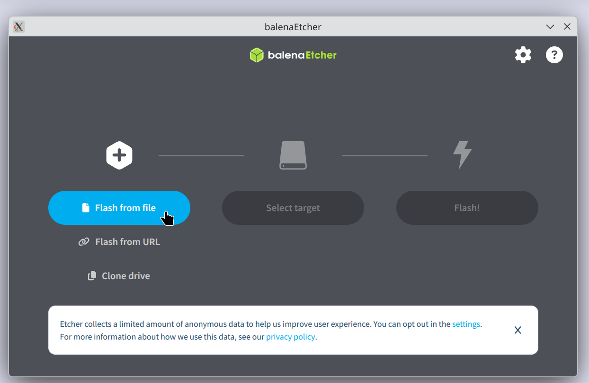

# Guide : Switching to Linux from Windows 10
by Bernardo Borges

## [Background - End of 10](https://endof10.org/) :window:

Extended support for Windows 10 ends on October 13, 2026.

Microsoft wants you to buy a new computer.

But what if you could make your current one fast and secure again?

If you bought your computer after 2010, there's most likely no reason to throw
it out. By just installing an up-to-date Linux operating system you can keep
using it for years to come.

Installing an operating system may sound difficult, but you don't have to do it
alone. With any luck, there are people in your area ready to help!

## Backup :inbox_tray:

You likely have many files in your Windows 10 system that you would like to
keep in you new Linux system. Here are some options for free cloud storage
so that you can upload your data during the installation procedure:

- [MEGA](mega.io) provides up to 20 GB of free cloud storage
- [Google Drive](https://workspace.google.com/products/drive/) provides each new
  user with 15 GB of free space

## Desktop Sharing :computer:

When getting help in the installation process, remote desktop software allows
another person that you trust to move the mouse and perform actions in your
system over the internet.

- AnyDesk - Remote Desktop Software for
  [Windows](https://anydesk.com/en/downloads/windows) and
  [Linux](https://anydesk.com/en/downloads/linux)

## Information about the system
In Windows, search **msinfo** to open the System Information, where we can check:
- _System Summary > System Type_ check if it's **x64-based PC**
- _Components > Display > Name_ for the GPU, if it's NVIDIA or not

# Installing Linux :penguin:

## Preparing the USB Stick :cd:

To install linux we will create a **USB Installer**, a USB Stick that contains
the programs to _install_ linux in your device. If you just want to test the
system, the USB Installer can also be used to _run a live system directly from
the USB_, without changing anything with your Windows system in the process.
This is good to check if programs and your devices work with the new system,
before committing to a real installation.

> :heavy_exclamation_mark: Attention: All data of the USB Stick will be lost. Be
> sure to backup it somewhere else before the flash

1. Download the [Zorin OS installation image](https://zorin.com/os/download/18/core/)
1. Download the [balena Etcher](https://etcher.balena.io/#download-etcher) SD
   card flasher app
1. Plug in a **USB Stick** with at least _4GiB_ of space
1. Run _balena Etcher_ and select the _Zorin OS installation image_ and the _USB
   Stick_, press **Flash** and wait while the image is flashed.

> :tada: Congratulations! Now you have created your own USB Installer for Zorin OS! 

## Starting the PC in the Live System :computer: :flashlight:

Before installing the system we will enter the live version of it, that runs exclusively on your USB Installer. To be able to do that however, we need to start your computer and tell it _not_ to open Windows, but to read the USB instead.

Check what key you have to use, depending on the manufacturer of your PC:

| Manufacturer | BIOS Key |
|:------------:|:--------:|
| ACER         | F2       |
| ASUS         | F9       |
| DELL         | F2       |
| HP           | F10      |
| LENOVO       | F2       |
| SAMSUNG      | F2       |
| SONY         | F2       |

1. Completely shut down the PC
1. Press the button to turn the PC on and keep pressed the _BIOS Key_ selected
   above. You will have succeeded if you can see the Boot Menu now, instead of
   Windows Booting.
1. Look for the options **Boot Override** and change the priority to boot the
   USB first.

> :nut_and_bolt: This part can be a little tricky, but it's done just the first
> time

4. When the boot list loads, just press _Enter_ to pick **Try or Install Zorin
   OS**, if you PC has a NVidia GPU choose **Try or Install Zorin OS (modern
   NVIDIA drivers)**
1. Now wait for the system to boot, where a screen will load where you can
   choose between **Try Zorin OS** or **Install Zorin OS**. Here connect to you
   WiFi and check common programs.

## Installing Zorin OS :recycle:
After you tested with the live environment, let's make it permanent and install
Zorin OS to the hard drive.

1. _Keyboard layout_, Pick you language and keyboard layout, make sure to test
   it in the "Type here" section
1. _Updates and other software_, leave checked the options _"Download updates
   while installing Zorin OS"_ and _"Install third-party software for graphics
   and Wi-Fi..."_
1. _Installation type_, since we made a backup of the important data, we can
   _"Erase disk and install Zorin OS"_
1. _Where are you?_, just choose your location for the time.
1. _Who are you?_, type in your full name, and give the computer a name like
   "asus11" that identifies the machine.
    - For the username, keep it simple with only lowercase english letters
    - For the password, choose a safe one. This will be used to install apps and
      programs later
    - If you don't want to type the password on every login, leave _"Log in
      automatically"_ checked
1. Now just wait for the installation process, it make take 20 minutes or more,
   depending on the machine. On **Installation Complete** just choose _Restart
   now_ and remove the USB Stick when prompted and press Enter.

## Post Installation - Security and Apps :closed_lock_with_key:
Your new Linux installation is ready! Log in with your chosen password to enter
it the first time!

- You can customize the appearance in "Zorin Appearance" or  by right clicking
  the task bar and choosing "Taskbar Settings"
- In _Settings > Network > Firewall Configuration_ turn the status to **ON**
- The alternatives for the _Microsoft Office_ applications are already installed:
    - Use **LibreOffice Writer** to open _MS Word_ files
    - Use **LibreOffice Calc** to open _MS Excel_ files
    - Use **LibreOffice Impress** to open _MS PowerPoint_ files
- The standard browser is **Brave Browser** but you can install **Firefox** or
  even **Google Chrome** by entering the _Software Center_ and looking for said
  package. There you can also find _Zoom_, _Spotify_ and many others.

> :bulb: For more information, check these videos by ExplainingComputers: [Zorin
> OS 18: Linux for Windows 10
> Users](https://www.youtube.com/watch?v=nplI2lvKu94&t=295s), [Linux Desktop
> Security: 5 Key Measures](https://www.youtube.com/watch?v=IqXK8zUfDtA)